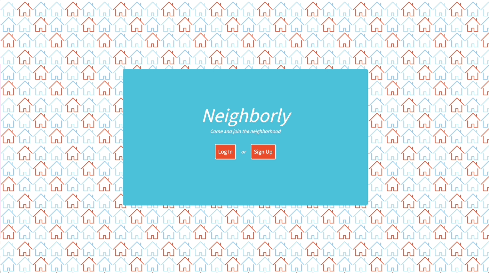
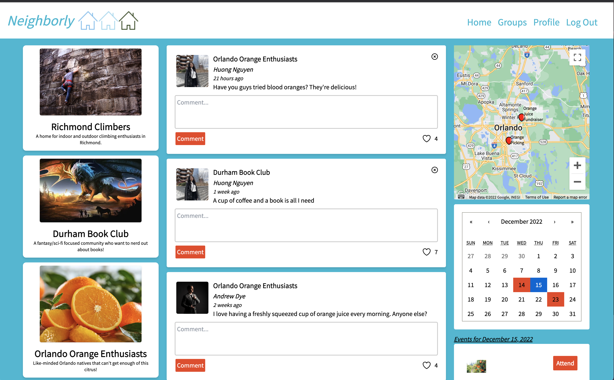
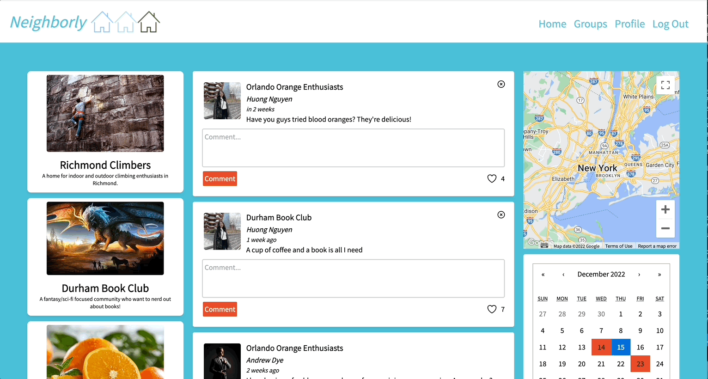
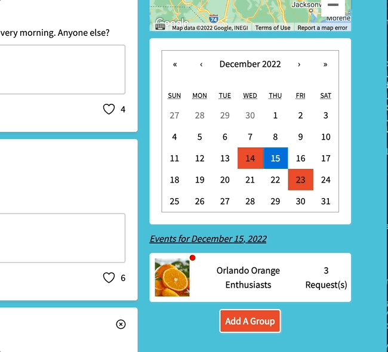
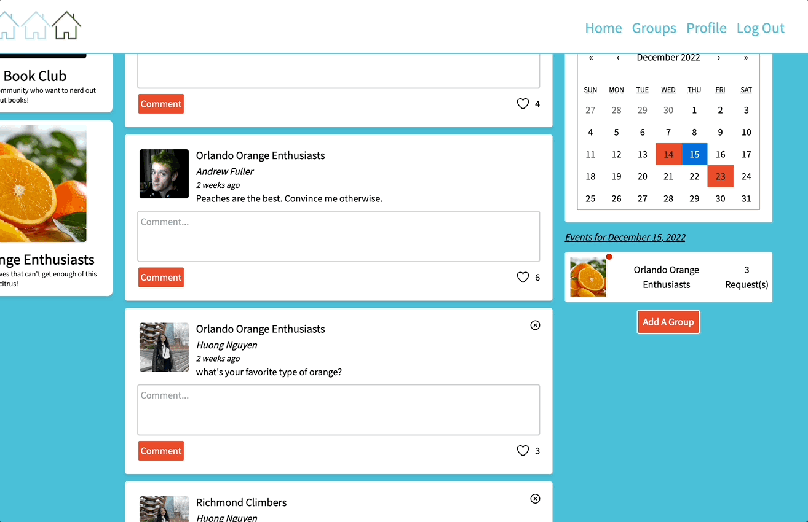
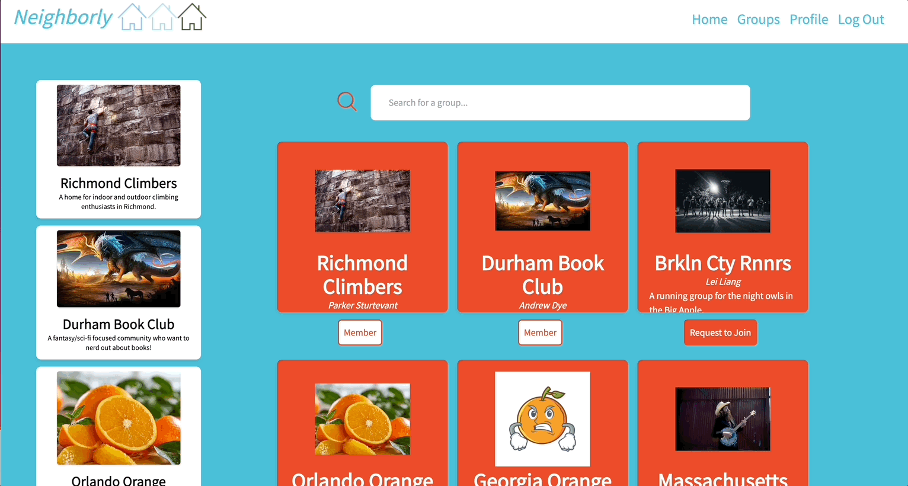
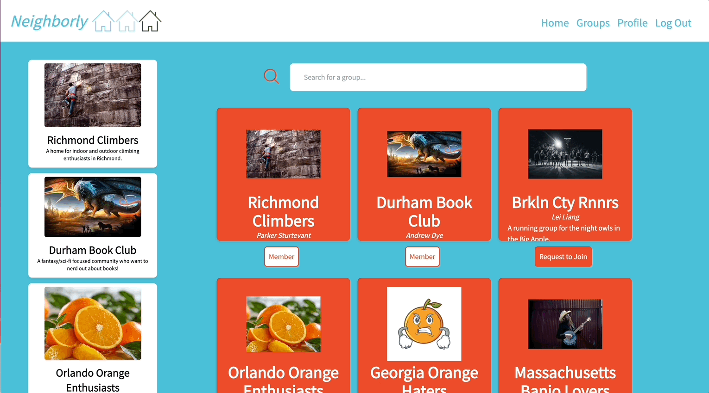
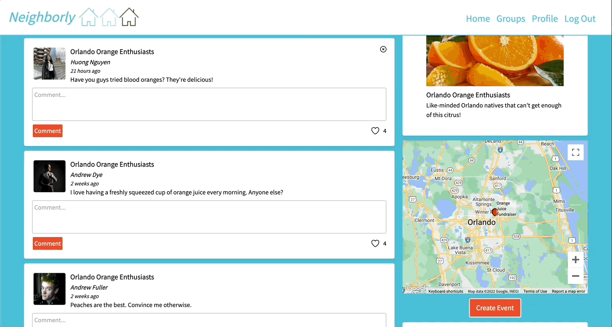
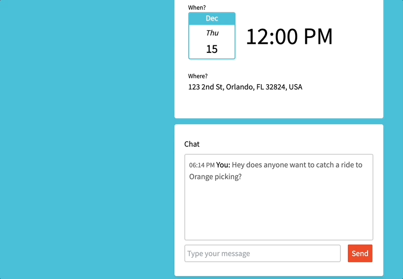
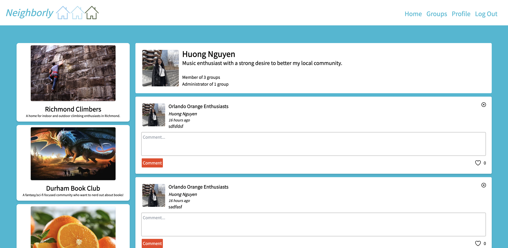

# Neighborly

## Overview

Neighborly is a private social media platform that’s safe for families and communities. Members can create groups and post events to strengthen community bonds.

## Table of Contents

- [Team](https://github.com/Neighborly-Saffron/Neighborly/tree/main#team)
- [Tech Stack](https://github.com/Neighborly-Saffron/Neighborly/tree/main#tech-stack)
- [Product Features](https://github.com/Neighborly-Saffron/Neighborly/tree/main#product-features)
  - [Login](https://github.com/Neighborly-Saffron/Neighborly/tree/main#login)
  - [Home Page](https://github.com/Neighborly-Saffron/Neighborly/tree/main#home-page)
  - [Groups Page](https://github.com/Neighborly-Saffron/Neighborly/tree/main#groups-page)
  - [Group Page](https://github.com/Neighborly-Saffron/Neighborly/tree/main#group-page)
  - [Profile](https://github.com/Neighborly-Saffron/Neighborly/tree/main#profile)
- [Getting Started](https://github.com/Neighborly-Saffron/Neighborly/tree/main#product-features)
- [Contributors](https://github.com/Neighborly-Saffron/Neighborly/tree/main#contributors)

## Team

- Andrew Dye
- Andrew Fuller
- Lei Liang
- Huong Nguyen
- Parker Sturtevant
- Gabe Yamartino

## Tech Stack


## Product Features

### Website Overview


## Login

Login authentication with Auth0


## Home Page

### Navigation Bar


### User's Group List

This section displays the groups the user is a member of


### Feed



### Map


### Calendar



### Group Administration Panel



### Create A Group


## Groups Page

### User's Group List

This section displays the groups the user is a member of


### Group Search



### Available Groups List



## Group Page

### Map


### Events


### Create Event



### Chat

The chat is available for users in the group to have real-time communication with other group members


## Profile

### User's Group List

This section displays the groups the user is a member of


### User Description



### User Feed


## Getting Started

### Installation

Ensure that you have node working on version 16.8.2 or higher. If you do not you can install it here https://nodejs.org/en/download/

#### Running in Production

In webpack.config.js, ensure mode is set to production. This will ensure the application is properly bundled for optimization.

```
module.exports = {
  mode: "production",
  ...
 }
```

> To run the build package in production mode run the following:

1. `npm run build`
2. `npm run server`
3. Open http://localhost:3001 in your browser

#### Running in Development

In webpack.config.js, ensure mode is set to development. This will ensure webpack re-bundles the application when changes are made.

```
module.exports = {
  mode: "development",
  ...
 }
```

> To run the build package in development mode run the following commands:

1. `npm start`
2. `npm run server`
3. Open http://localhost:3001 in your browser

#### Hosting

### Requirements

(https://nodejs.org/en/download/)

## Contributors

<a href="https://github.com/Neighborly-Saffron/Neighborly/graphs/contributors">
  
</a>
